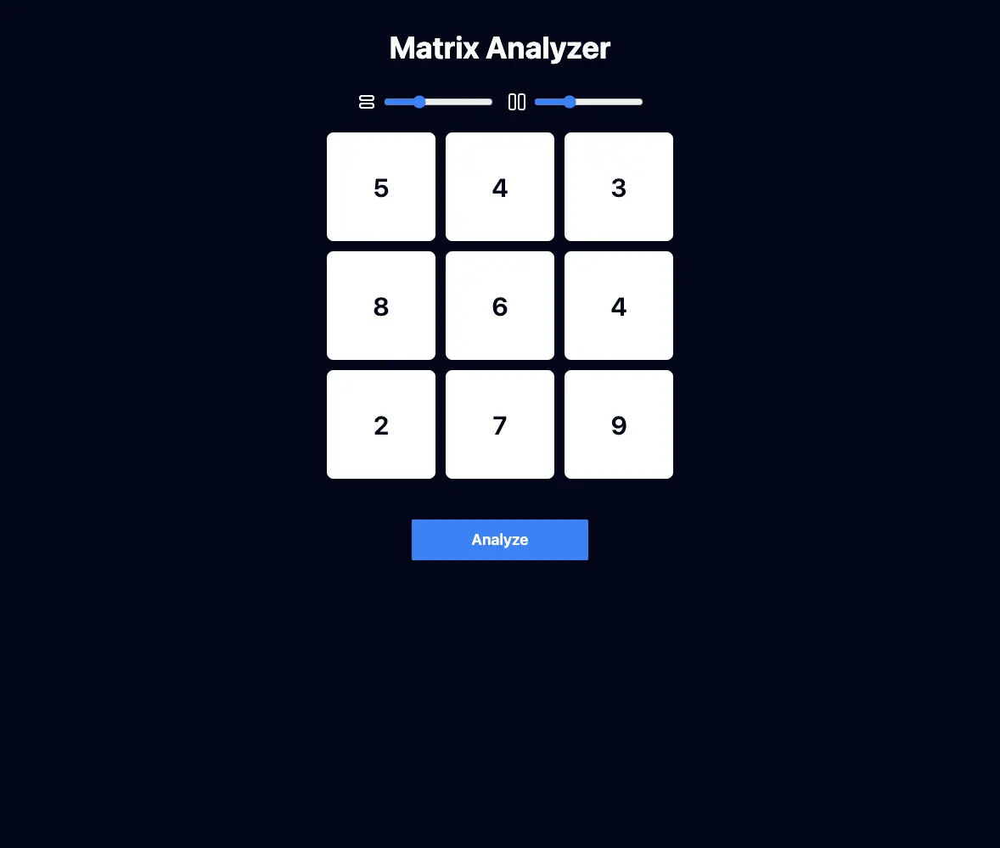
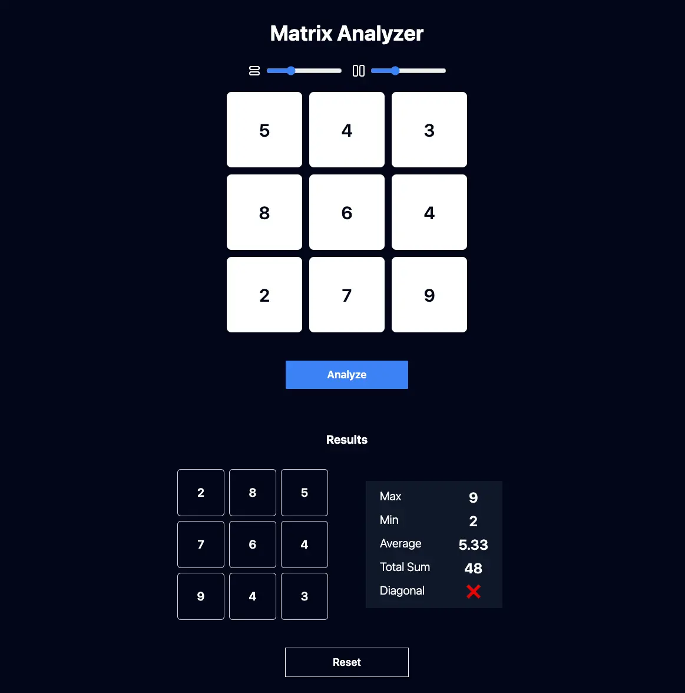

# MatrixAnalyzer 📊🔄

## Description

**MatrixAnalyzer** is a React and Vite-based frontend application that consumes two APIs to display matrix rotation results and additional statistics. The app provides an interactive and user-friendly interface for real-time QR decomposition and statistical analysis.

## Features

- 🔄 **Matrix Rotation**: Rotate matrices and visualize the results instantly.
- 📊 **Statistical Analysis**: View detailed matrix statistics such as maximum, minimum, average, and more.
- 🎯 **Interactive UI**: Easy-to-use interface with real-time data updates.

## Installation

1. Clone the repository:

   ```bash
   git clone https://github.com/yourusername/matrix-analyzer.git
   ```

2. Navigate to the project directory:

   ```bash
   cd matrix-analyzer
   ```

3. Install the dependencies:

   ```bash
   npm install
   ```

## Usage

1. Start the development server:

   ```bash
   npm run dev
   ```

   The application will be available at `http://localhost:5173`.

2. Interact with the APIs:

   - **Matrix Rotation API**: Make requests to rotate matrices and view visual results.
   - **Statistics API**: Get detailed matrix statistics like max, min, average, etc.

## Environment Variables

Ensure to copy the `.env.example` file to `.env` before starting the project:

```bash
cp .env.example .env
```

The environment variables must be set for the project to function. By default, `PORT` is an empty string, so be sure to configure all environment variables.

## Screenshot

Here's a preview of **MatrixAnalyzer** in action:

1. **Matrix Input Form**:  
   

2. **Matrix Rotation & Statistics Results**:  
   

## Demo

🚀 Check out the live demo here: [MatrixAnalyzer Demo](https://yourdemo.com)
